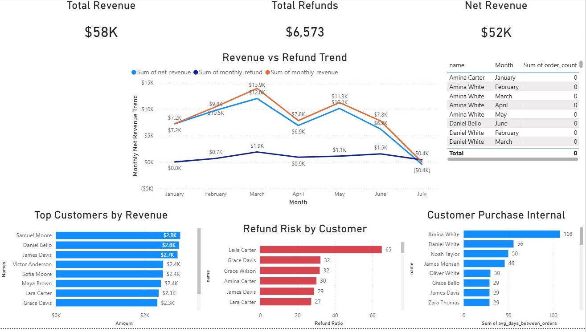

# commercepulse-ecommerce-analysis
SQL and Power BU analysis of an e-commerce dataset focusing on revenue performance, customer behaviour, and refund risk.

PROJECT OVERVIEW: 
This project analyzes e-commerce transaction data to identify revenue trends, customer behaviour patterns, refund risk, and operational anomalies. The analysis was conducted using SQL and visualised in Power BI.

TOOL USED:
SQL (SQLite)
Power BI
GitHub

DATASET STRUCTURE
customers
orders
order_items
products
refunds

BUSINESS QUESTIONS
1. What is the monthly revenue trend?
2. Which customers generate the most revenue?
3. Which customers have the highest refund ratios?
4. How frequently do customers make purchases?
5. Which customers place repeat orders within 30 days?
6. Which customers show inactivity across months?
7. Which customers exhibit burst purchasing behavior?

KEY INSIGHTS
* Revenue is primarily driven by customers with relatively low refund ratios, while customers with high refund ratios contribute little revenue. This suggests that refund-related losses are concentrated among low-value customers rather than top spenders.
* Customer purchase intervals vary widely, ranging from 9 days to over 100 days, indicating clear behavioural segmentation between loyal, occasional, and infrequent buyers.
* The business generated approximately 52k in net revenue over the observed period, with refunds totaling around 6k. However, July shows negative net revenue due to refunds exceeding sales. This may indicate either operational issues or incomplete transactional data for that month and should be further investigated.
* Revenue is somewhat concentrated among the top three customers, but overall revenue distribution remains relatively balanced across the customer base. This reduces reliance on a small number of clients while still benefiting from high-value buyers.

### How to Reproduce This Analysis

1. Load the dataset into SQLite.
2. Run the SQL queries in the `sql_queries` folder.
3. Export the result tables as CSV.
4. Load the CSV files into Power BI.
5. Open the dashboard file located in the `dashboard` folder.
